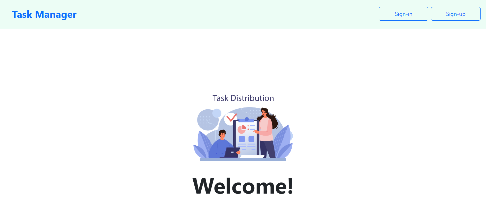
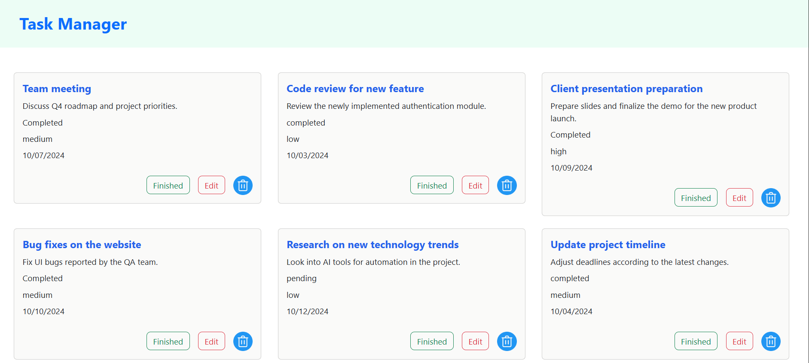
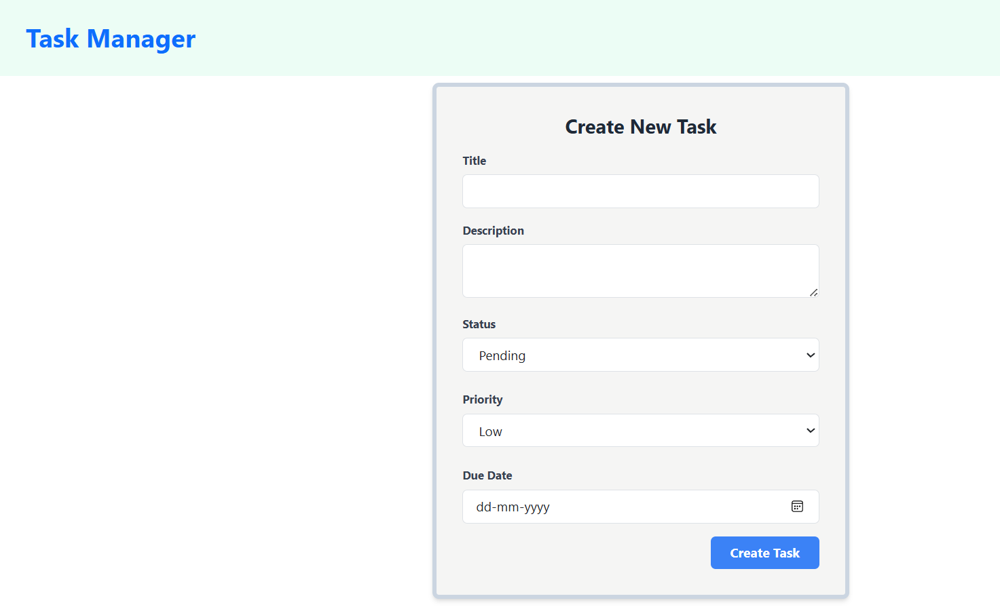

# MERN Stack Shopping Store

A simple, and efficient Task Manager built using the MERN (MongoDB, Express.js, React, Node.js) stack. This allows users to add, delete and edit tasks, and also mark them as finished.

## Features

- User can SignUp/Login for their Accounts

- Manage your tasks
 

- Add new tasks.

- delete unwanted tasks.

## Technology Stack

- **Frontend**: React, Tailwind CSS
- **Backend**: Node.js, Express.js
- **Database**: MongoDB

## Installation

1. Clone the repository:
2. Install dependencies for backend and frontend  (using npm install):
3. Set up environment variables:
4. Start the backend server(npm run dev):
5. In a new terminal, start the frontend using (npm run dev)
6. And visit the given link.

